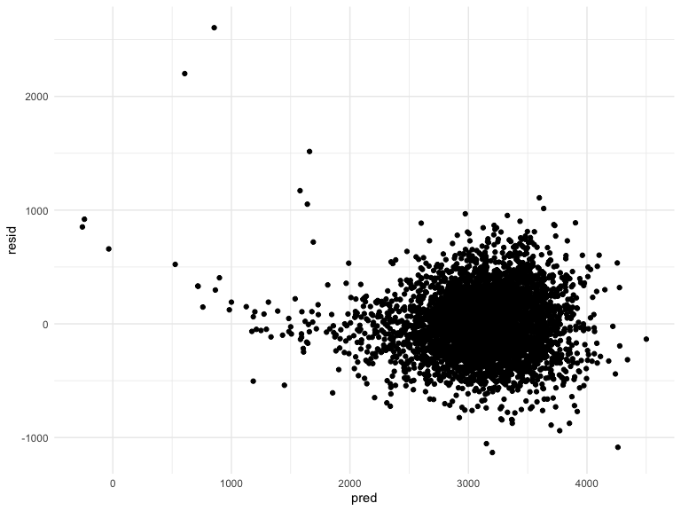

p8105\_HW6\_rkm2147
================
Ronae McLin
12/7/2020

``` r
library(tidyverse)
library(modelr)
library(p8105.datasets)
```

### Problem 1

``` r
homicide_df = 
  read_csv("./large_data/homicide-data.csv", na = c("", "NA", "Unknown")) %>% 
  mutate(
    city_state = str_c(city, state, sep = ", "),
    victim_age = as.numeric(victim_age),
    resolution = case_when(
      disposition == "Closed without arrest" ~ 0,
      disposition == "Open/No arrest"        ~ 0,
      disposition == "Closed by arrest"      ~ 1)
  ) %>% 
  filter(
    victim_race %in% c("White", "Black"),
    city_state != "Tulsa, AL") %>% 
  select(city_state, resolution, victim_age, victim_race, victim_sex)
```

    ## Parsed with column specification:
    ## cols(
    ##   uid = col_character(),
    ##   reported_date = col_double(),
    ##   victim_last = col_character(),
    ##   victim_first = col_character(),
    ##   victim_race = col_character(),
    ##   victim_age = col_double(),
    ##   victim_sex = col_character(),
    ##   city = col_character(),
    ##   state = col_character(),
    ##   lat = col_double(),
    ##   lon = col_double(),
    ##   disposition = col_character()
    ## )

Start with one city.

``` r
baltimore_df =
  homicide_df %>% 
  filter(city_state == "Baltimore, MD")
glm(resolution ~ victim_age + victim_race + victim_sex, 
    data = baltimore_df,
    family = binomial()) %>% 
  broom::tidy() %>% 
  mutate(
    OR = exp(estimate),
    CI_lower = exp(estimate - 1.96 * std.error),
    CI_upper = exp(estimate + 1.96 * std.error)
  ) %>% 
  select(term, OR, starts_with("CI")) %>% 
  knitr::kable(digits = 3)
```

| term              |    OR | CI\_lower | CI\_upper |
| :---------------- | ----: | --------: | --------: |
| (Intercept)       | 1.363 |     0.975 |     1.907 |
| victim\_age       | 0.993 |     0.987 |     1.000 |
| victim\_raceWhite | 2.320 |     1.648 |     3.268 |
| victim\_sexMale   | 0.426 |     0.325 |     0.558 |

Try this across cities.

``` r
models_results_df = 
  homicide_df %>% 
  nest(data = -city_state) %>% 
  mutate(
    models = 
      map(.x = data, ~glm(resolution ~ victim_age + victim_race + victim_sex, data = .x, family = binomial())),
    results = map(models, broom::tidy)
  ) %>% 
  select(city_state, results) %>% 
  unnest(results) %>% 
  mutate(
    OR = exp(estimate),
    CI_lower = exp(estimate - 1.96 * std.error),
    CI_upper = exp(estimate + 1.96 * std.error)
  ) %>% 
  select(city_state, term, OR, starts_with("CI")) 
```

``` r
models_results_df %>% 
  filter(term == "victim_sexMale") %>% 
  mutate(city_state = fct_reorder(city_state, OR)) %>% 
  ggplot(aes(x = city_state, y = OR)) + 
  geom_point() + 
  geom_errorbar(aes(ymin = CI_lower, ymax = CI_upper)) + 
  theme(axis.text.x = element_text(angle = 90, hjust = 1))
```


## Problem 2

Find some residuals

Data looks pretty tidy already, don’t think we need to do any cleaning
up in this aspect. all variables are numeric as well.

``` r
baby_df = 
  read_csv("./large_data/birthweight.csv")
```

    ## Parsed with column specification:
    ## cols(
    ##   .default = col_double()
    ## )

    ## See spec(...) for full column specifications.

fit a model

In order to insure that I am able to cross validate, the model i created
are nested with the two models i will need to compare during a later
stage of the homework. in addition to these 4 required variables, i
added one more additional variable, `momage` to see how that predictor
influences the outcome.

``` r
model = lm(bwt~ blength + bhead + babysex + gaweeks + momage, data = baby_df)
```

**make a plot**

show a plot of model residuals against fitted values – use
add\_predictions and add\_residuals in making this plot.

``` r
fit_1 = lm(bwt ~ blength + gaweeks, data = baby_df)
fit_2 = lm(bwt ~ bhead*blength + babysex*bhead + babysex*blength + babysex*bhead*blength, data = baby_df)
```

``` r
fit_2 %>% 
  broom::tidy()
```

    ## # A tibble: 8 x 5
    ##   term                   estimate std.error statistic     p.value
    ##   <chr>                     <dbl>     <dbl>     <dbl>       <dbl>
    ## 1 (Intercept)           -13552.     2759.       -4.91 0.000000939
    ## 2 bhead                    380.       83.4       4.56 0.00000528 
    ## 3 blength                  226.       57.4       3.94 0.0000843  
    ## 4 babysex                 6375.     1678.        3.80 0.000147   
    ## 5 bhead:blength             -4.43      1.72     -2.58 0.00981    
    ## 6 bhead:babysex           -198.       51.1      -3.88 0.000105   
    ## 7 blength:babysex         -124.       35.1      -3.52 0.000429   
    ## 8 bhead:blength:babysex      3.88      1.06      3.67 0.000245

``` r
model_fit = lm(bwt ~ gaweeks, data = baby_df)
```

``` r
baby_df %>% 
  modelr::add_residuals(model_fit) %>% 
  ggplot(aes(x = gaweeks, y = resid)) + 
  geom_point()
```



### Problem 3
