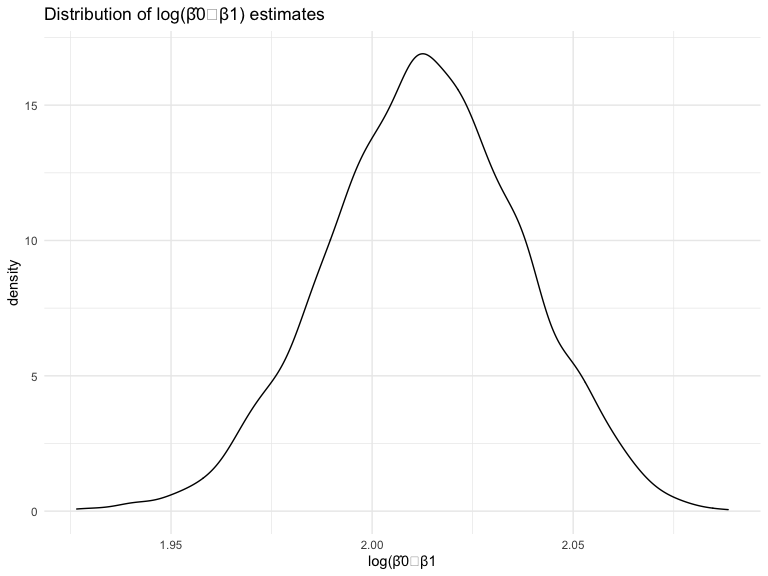

p8105\_HW6\_rkm2147
================
Ronae McLin
12/7/2020

``` r
library(tidyverse)
library(modelr)
library(p8105.datasets)
library(mgcv)
```

    ## Loading required package: nlme

    ## 
    ## Attaching package: 'nlme'

    ## The following object is masked from 'package:dplyr':
    ## 
    ##     collapse

    ## This is mgcv 1.8-33. For overview type 'help("mgcv-package")'.

### Problem 1

``` r
homicide_df = 
  read_csv("./large_data/homicide-data.csv", na = c("", "NA", "Unknown")) %>% 
  mutate(
    city_state = str_c(city, state, sep = ", "),
    victim_age = as.numeric(victim_age),
    resolution = case_when(
      disposition == "Closed without arrest" ~ 0,
      disposition == "Open/No arrest"        ~ 0,
      disposition == "Closed by arrest"      ~ 1)
  ) %>% 
  filter(
    victim_race %in% c("White", "Black"),
    city_state != "Tulsa, AL") %>% 
  select(city_state, resolution, victim_age, victim_race, victim_sex)
```

    ## Parsed with column specification:
    ## cols(
    ##   uid = col_character(),
    ##   reported_date = col_double(),
    ##   victim_last = col_character(),
    ##   victim_first = col_character(),
    ##   victim_race = col_character(),
    ##   victim_age = col_double(),
    ##   victim_sex = col_character(),
    ##   city = col_character(),
    ##   state = col_character(),
    ##   lat = col_double(),
    ##   lon = col_double(),
    ##   disposition = col_character()
    ## )

Start with one city.

``` r
baltimore_df =
  homicide_df %>% 
  filter(city_state == "Baltimore, MD")
glm(resolution ~ victim_age + victim_race + victim_sex, 
    data = baltimore_df,
    family = binomial()) %>% 
  broom::tidy() %>% 
  mutate(
    OR = exp(estimate),
    CI_lower = exp(estimate - 1.96 * std.error),
    CI_upper = exp(estimate + 1.96 * std.error)
  ) %>% 
  select(term, OR, starts_with("CI")) %>% 
  knitr::kable(digits = 3)
```

| term              |    OR | CI\_lower | CI\_upper |
| :---------------- | ----: | --------: | --------: |
| (Intercept)       | 1.363 |     0.975 |     1.907 |
| victim\_age       | 0.993 |     0.987 |     1.000 |
| victim\_raceWhite | 2.320 |     1.648 |     3.268 |
| victim\_sexMale   | 0.426 |     0.325 |     0.558 |

Try this across cities.

``` r
models_results_df = 
  homicide_df %>% 
  nest(data = -city_state) %>% 
  mutate(
    models = 
      map(.x = data, ~glm(resolution ~ victim_age + victim_race + victim_sex, data = .x, family = binomial())),
    results = map(models, broom::tidy)
  ) %>% 
  select(city_state, results) %>% 
  unnest(results) %>% 
  mutate(
    OR = exp(estimate),
    CI_lower = exp(estimate - 1.96 * std.error),
    CI_upper = exp(estimate + 1.96 * std.error)
  ) %>% 
  select(city_state, term, OR, starts_with("CI")) 
```

``` r
models_results_df %>% 
  filter(term == "victim_sexMale") %>% 
  mutate(city_state = fct_reorder(city_state, OR)) %>% 
  ggplot(aes(x = city_state, y = OR)) + 
  geom_point() + 
  geom_errorbar(aes(ymin = CI_lower, ymax = CI_upper)) + 
  theme(axis.text.x = element_text(angle = 90, hjust = 1))
```


## Problem 2

### load data and tidy

``` r
baby_df = 
  read_csv("./large_data/birthweight.csv")
```

    ## Parsed with column specification:
    ## cols(
    ##   .default = col_double()
    ## )

    ## See spec(...) for full column specifications.

tidy baby data frame, names were placed for the numeric values

``` r
baby_df = 
  baby_df %>% 
  mutate(
    babysex = case_when(
      babysex == "1" ~ "male",
      babysex == "2" ~ "female"
    ),
    
    frace = case_when(
      frace == "1" ~ "white", 
      frace == "2" ~ "black",
      frace == "3" ~ "asian", 
      frace == "4" ~ "puerto rican",
      frace == "8" ~ "other", 
      frace == "9" ~ "unknown"
      
      ),
    
    malform = case_when(
      malform == "0" ~ "absent",
      malform == "1" ~ "present" 
    ),
    
    mrace = case_when(
      mrace == "1" ~ "white", 
      mrace == "2" ~ "black",
      mrace == "3" ~ "asian", 
      mrace == "4" ~ "puerto rican",
      mrace == "8" ~ "other" 
  ))
```

In order to insure that I am able to cross validate, the model i created
are nested with the two models i will need to compare during a later
stage of the homework. in addition to these 4 required variables, i
added one more additional variable, `momage` to see how that predictor
influences the outcome.

``` r
#model1 on the plot
my_model = lm(bwt~ blength + bhead + babysex + gaweeks + momage, data = baby_df)

#model2 and model3 respectively
fit_1 = lm(bwt ~ blength + gaweeks, data = baby_df)
fit_2 = lm(bwt ~ bhead*blength + babysex*bhead + babysex*blength + babysex*bhead*blength, data = baby_df)
```

### Create a model and plot it\!

We can observe from this plot that it is left skewed, with values
clustering between 2000-4000 (for predictions). No distinct trends
appear from this plot. Extreme outliers can be observed around
prediction value of 1000 and below. Also this can observed for residuals
greater than 1000. There appears to be 3 values that are above 1500 for
residual values.

``` r
residual_plot = 
baby_df %>% 
  modelr::add_residuals(my_model) %>% 
  add_predictions(my_model) %>%  
  ggplot(aes(x = pred, y = resid)) + 
  geom_point() +
  labs(
    title = "plot of my proposed model's residuals against fitted values",
    x = "Predictions",
    y = "Residuals"
  )

residual_plot
```


### tidy table of the created models

``` r
#this is model1 on the plot
my_model %>% 
   broom::tidy() %>% 
  knitr::kable(digits = 3)
```

| term        |   estimate | std.error | statistic | p.value |
| :---------- | ---------: | --------: | --------: | ------: |
| (Intercept) | \-6291.447 |    97.042 |  \-64.832 |       0 |
| blength     |     81.735 |     2.075 |    39.398 |       0 |
| bhead       |    139.890 |     3.559 |    39.301 |       0 |
| babysexmale |   \-34.666 |     8.815 |   \-3.932 |       0 |
| gaweeks     |     13.429 |     1.513 |     8.874 |       0 |
| momage      |      5.934 |     1.125 |     5.273 |       0 |

let’s look at the first model we need to compare

``` r
#this is model2 on the plot
fit_1 %>% 
   broom::tidy() %>% 
  knitr::kable(digits = 3)
```

| term        |   estimate | std.error | statistic | p.value |
| :---------- | ---------: | --------: | --------: | ------: |
| (Intercept) | \-4347.667 |    97.958 |  \-44.383 |       0 |
| blength     |    128.556 |     1.990 |    64.604 |       0 |
| gaweeks     |     27.047 |     1.718 |    15.744 |       0 |

let’s look at the second model we need to compare

``` r
# this is model3 on the plot
fit_2 %>% 
   broom::tidy() %>% 
  knitr::kable(digits = 3)
```

| term                      |   estimate | std.error | statistic | p.value |
| :------------------------ | ---------: | --------: | --------: | ------: |
| (Intercept)               |  \-801.949 |  1102.308 |   \-0.728 |   0.467 |
| bhead                     |   \-16.598 |    34.092 |   \-0.487 |   0.626 |
| blength                   |   \-21.646 |    23.372 |   \-0.926 |   0.354 |
| babysexmale               | \-6374.868 |  1677.767 |   \-3.800 |   0.000 |
| bhead:blength             |      3.324 |     0.713 |     4.666 |   0.000 |
| bhead:babysexmale         |    198.393 |    51.092 |     3.883 |   0.000 |
| blength:babysexmale       |    123.773 |    35.119 |     3.524 |   0.000 |
| bhead:blength:babysexmale |    \-3.878 |     1.057 |   \-3.670 |   0.000 |

### Cross validation

``` r
cv_df = 
  crossv_mc(baby_df, 100) 
```

``` r
cv_df =
  cv_df %>% 
  mutate(
    train = map(train, as_tibble),
    test = map(test, as_tibble))
```

Cross validation occurs

``` r
cv_df =
  cv_df %>% 
  mutate(
    model_1 = map(.x = train, ~lm(bwt ~ blength + bhead + babysex + gaweeks +                                   momage, data = .x)),
    model_2 = map(.x = train, ~lm(bwt ~ blength + gaweeks, data = .x)),
    model_3 = map(.x = train, ~lm(bwt ~ bhead*blength + babysex*bhead +  
                                 babysex*blength + babysex*bhead*blength, 
                                data = .x)),
     rmse_model1 = map2_dbl(.x = model_1, .y = test, ~rmse(model = .x, data = .y)),
    rmse_model2 = map2_dbl(.x = model_2, .y = test, ~rmse(model = .x, data = .y)),
    rmse_model3 = map2_dbl(.x = model_3, .y = test, ~rmse(model = .x, data = .y)))
```

We can observe that my proposed model (model1 on the plot) is more
parsimonious with model 3 than with model2. The two models are
relatively similar except for the `momage` variable, so this makes
sense.

``` r
validation_plot = 
cv_df %>% 
  select(starts_with("rmse")) %>% 
  pivot_longer(
    everything(),
    names_to = "model", 
    values_to = "rmse",
    names_prefix = "rmse_") %>% 
  mutate(model = fct_inorder(model)) %>% 
  ggplot(aes(x = model, y = rmse)) + geom_violin() +
  labs(
    title = "plot of my proposed model vs the model2 and model3",
    x = "rmse",
    y = "Model"
  )

validation_plot
```


### Problem 3

load data

``` r
weather_df = 
  rnoaa::meteo_pull_monitors(
    c("USW00094728"),
    var = c("PRCP", "TMIN", "TMAX"), 
    date_min = "2017-01-01",
    date_max = "2017-12-31") %>%
  mutate(
    name = recode(id, USW00094728 = "CentralPark_NY"),
    tmin = tmin / 10,
    tmax = tmax / 10) %>%
  select(name, id, everything())
```

    ## Registered S3 method overwritten by 'hoardr':
    ##   method           from
    ##   print.cache_info httr

    ## using cached file: /Users/ronaemclin1/Library/Caches/R/noaa_ghcnd/USW00094728.dly

    ## date created (size, mb): 2020-10-01 13:06:24 (7.519)

    ## file min/max dates: 1869-01-01 / 2020-09-30

``` r
#pulled from p8105 lecture as a guidance
n_samp = 5000

sim_df_const = 
  tibble(
    x = rnorm(n_samp, 1, 1),
    error = rnorm(n_samp, 0, 1),
    y = 2 + 3 * x + error
  )

sim_df_nonconst = sim_df_const %>% 
  mutate(
  error = error * .75 * x,
  y = 2 + 3 * x + error
)

sim_df = 
  bind_rows(const = sim_df_const, nonconst = sim_df_nonconst, .id = "weather_df") 
```

Preparation of the data frame for the first component of the problem

``` r
boot_df = 
weather_df %>% 
  modelr::bootstrap(n = 5000) %>% 
  mutate(
    models = map(strap, ~lm(tmax~tmin, data = .x)),
    results = map(models, broom::glance)
  ) %>% 
  select(results, .id) %>% 
  unnest(results)
```

We can observe from the r-squared plot that the distribution is
relatively normal. There is a slight left skew, towards where the values
are closer to 1.

``` r
r2_plot = 
  boot_df %>% 
  ggplot(aes(x = r.squared)) + geom_density() +
  labs(
    title = "Distribution of r.squared estimates",
    x = "r.squared",
    y = "density"
  )


r2_plot  
```


Preparation of the data frame for the next component of the problem

``` r
beta_df = 
weather_df %>% 
  modelr::bootstrap(n = 5000) %>% 
  mutate(
    models = map(strap, ~lm(tmax~tmin, data = .x)),
    results = map(models, broom::tidy)
  ) %>% 
  select(results, .id) %>% 
  unnest(results) %>% 
  select(term, estimate) %>% 
  pivot_wider(
  names_from = "term", 
  values_from = "estimate") %>% 
  janitor::clean_names() %>% 
  unnest(tmin, intercept) %>% 
mutate(
    newvalue = log(intercept*tmin)
  )
```

We can observe from the log(β̂0∗β1) plot that the distribution is
relatively normal.

``` r
beta_plot = 
  beta_df %>% 
  ggplot(aes(x = log(intercept*tmin))) + geom_density() +
  labs(
    title = "Distribution of log(β̂0∗β1) estimates",
    x = "log(β̂0∗β1",
    y = "density"
  )
 
beta_plot 
```



The 95% confidence interval created via the 2.5% and 97.5% quantiles for
r squared is as follows

``` r
  quantile(boot_df$r.squared, 0.025)
```

    ##      2.5% 
    ## 0.8928156

``` r
  quantile(boot_df$r.squared, .975) 
```

    ##     97.5% 
    ## 0.9272971

The 95% confidence interval created via the 2.5% and 97.5% quantiles for
log(β̂0∗β1 is as follows

``` r
  quantile(beta_df$newvalue, 0.025)
```

    ##     2.5% 
    ## 1.965331

``` r
  quantile(beta_df$newvalue, .975) 
```

    ##    97.5% 
    ## 2.059737
